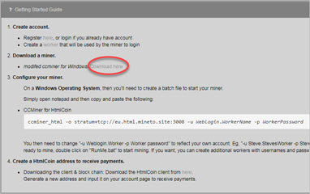

# htmlmining FAQ

Unofficial HTMLCOIN Mining Group FAQ

**When I run ccminer, I get an `invalid device symbol` error.**

GPU dev said the card does not support the features required in ccminer. This is not specific to HTMLCOIN version, this will occur in tpruvot's ccminer as well. Workaround is to use bfgminer and hash using OpenCL drivers.

- [invalid device symbol 1](./images/invalid-device-symbol-1.jpg)
- [invalid device symbol 2](./images/invalid-device-symbol-2.jpg)
- [invalid device symbol 3](./images/invalid-device-symbol-3.jpg)

**When pool?**

[https://html.mineto.site/index.php?page=gettingstarted](https://html.mineto.site/index.php?page=gettingstarted)

You must download the custom Windows binary of ccminer from the pool web site. We are currently working with pool operator to make it compatible with [mghtthr's ccminer](https://github.com/mghtthr/ccminer) .