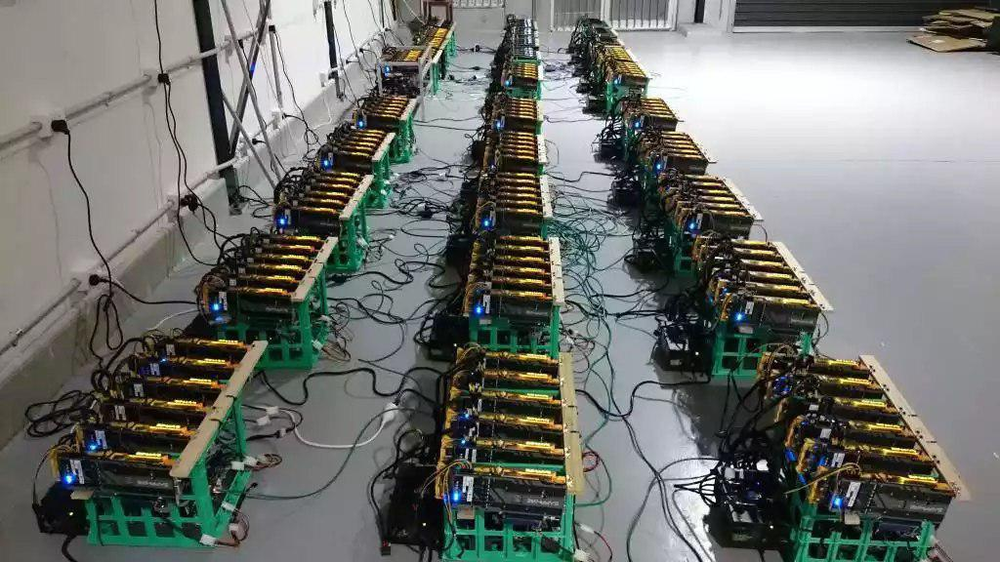

**HTMLCOIN GPU hash rates**

These are GPU hash rates based on screenshots from the [Unofficial HTMLCoin Mining Group on Telegram](https://t.me/htmlmining)

**Manufacturer, Model | Hashrate | Notes | Image**

## NVIDIA

- Generic GTX 1050 | 202 MH/s | intensity 25 | [geforce-gtx1050](./images/geforce-gtx1050.jpg)
- MSI GTX 970 | 385 MH/s | 1316 MHz 2504 kH/W 153W 56C FAN 56% | [msi-gtx970](./images/msi-gtx970.jpg)
- MSI GTX 970 | 386 MH/s | 166W 62C FAN 48% | [msi-gtx970-1](./images/msi-gtx970-1.jpg)
- ASUS GTX 1060 6GB | 445 MH/s | 1886 MHz 4308 kH/W 103W 68C FAN 38% | [asus-gtx1060-1](./images/asus-gtx1060-1.jpg)
- ASUS GTX 980 | 450 MH/s | 1328 MHz 2479 kH/W 182W 72C FAN 66% | [asus-gtx980](./images/asus-gtx980.jpg)
- ASUS GTX 1060 6GB | 465 MH/s | 1965 MHz 4095 kH/W 113W 66C FAN 51% | [asus-gtx1060-2](./images/asus-gtx1060-2.jpg)
- Gigabyte GTX 980 Ti | 666 MH/s | | [gigabyte-gtx980ti-666](./images/gigabyte-gtx980ti-666.jpg)
- ASUS GTX 1080  | 840 MH/s - 940 MH/s | | [asus-gtx1080](./images/asus-gtx1080.jpg)
- Gigabyte GTX 1080 Ti | 937 MH/s | | [gigabyte-gtx1080ti](./images/gigabyte-gtx1080ti.jpg)
- Gigabyte GTX 1080 Ti | 1200 MH/s | | [gigabyte-gtx1080ti](./images/gigabyte-gtx1080ti.jpg)

## AMD

- AMD R9 200 Series | 90 MH/s | | [amd-1](./images/amd-1.jpg)
- AMD Radeon HD 5700 Series | 94 MH/s | | [amd-2](./images/amd-2.jpg)
- AMD Radeon HD 7800 Series | 157 MH/s | | [amd-2](./images/amd-2.jpg)
- AMD RX480 | 257 MH/s | | [amd-1](./images/amd-1.jpg)
- AMD RX470 | 577 MH/s | 52C | [amd-3](./images/amd-3.jpg)
- AMD RX470 | 578 MH/s | 52C | [amd-3](./images/amd-3.jpg)
- AMD RX480 | 641 MH/s | 53C | [amd-3](./images/amd-3.jpg)
- AMD RX480 | 649 MH/s | 53C | [amd-3](./images/amd-3.jpg)