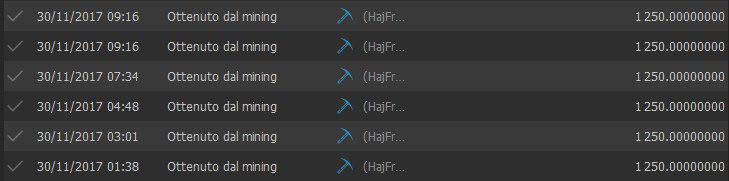

When HTMLCOIN was released in Nov 2017, the difficulty was very low and you could mine it using your CPU. You mine many blocks all day long.

In February 2018, the difficulty spiked making everyone speculate that someone built a private GPU miner (Telegram: korni). This ended CPU mining and HTMLCOIN officially became a GPU mineable coin.

Other developers, released open source GPU around the same time. johninaustin released a an AMD/openCL GPU miner. mghtthr wrote a Nvidia GPU miner. I believe mghtthr was able to claim the bounty for the GPU miner.
