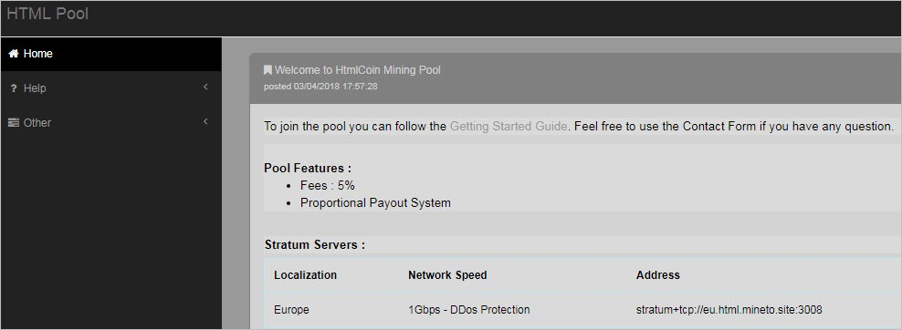

# Pool Mining

----------

Setting up a miner for a HTMLCOIN pool is much simpler than solo mining. All you need is a HTMLCOIN compatible GPU miner and a HTMLCOIN receiving address. 

## MineTo

There is currently only one mining pool we know of which is run by Alex Ya (Telegram: @Yatson).

Pool charges 5% fee with a payout system called Proportional. Every block reward of 1250, pool operator keeps 5% or 62.5 HTMLCOIN. The rest is shared equally based on the number of accepted shares you submitted this round divided by shares submitted in this round by all miners.

For example, if you submitted 10,000 shares and total shares submitted for this round is 100,000, you would receive 10% of the block reward.

Website: [https://html.mineto.site/](https://html.mineto.site/index.php)

[https://html.mineto.site/index.php?page=gettingstarted](https://html.mineto.site/index.php?page=gettingstarted)

modifed ccminer for Windows: [https://drive.google.com/file/d/1nAM80H6PLA_vMuYEBo6gFZQQrDc5a7Hr/view?usp=sharing](https://drive.google.com/file/d/1nAM80H6PLA_vMuYEBo6gFZQQrDc5a7Hr/view?usp=sharing)

You must use this custom binary to mine with this pool.

To mine on pool, use the following command:

`ccminer_html -a html -o stratum+tcp://eu.html.mineto.site:3008 -u Weblogin.WorkerName -p WorkerPassword`

- Weblogin is the user id you registered with on the site
- WorkerName is work you set up after you registered on the site
- WorkerPassword is the password you set up when you were setting up WorkerName
